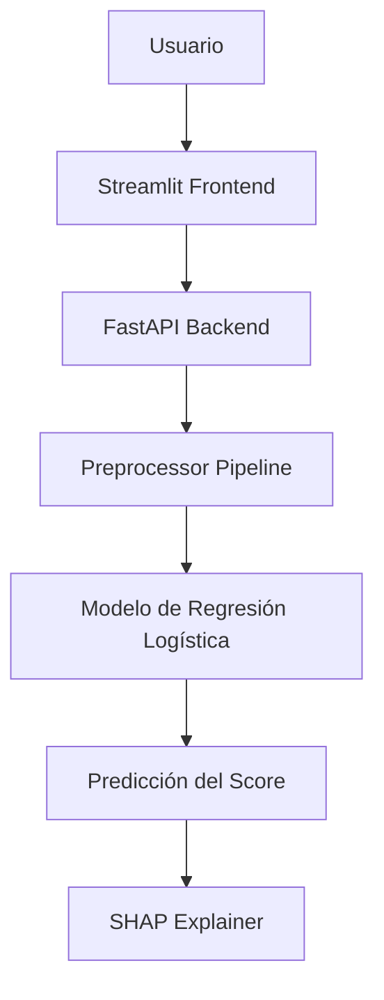
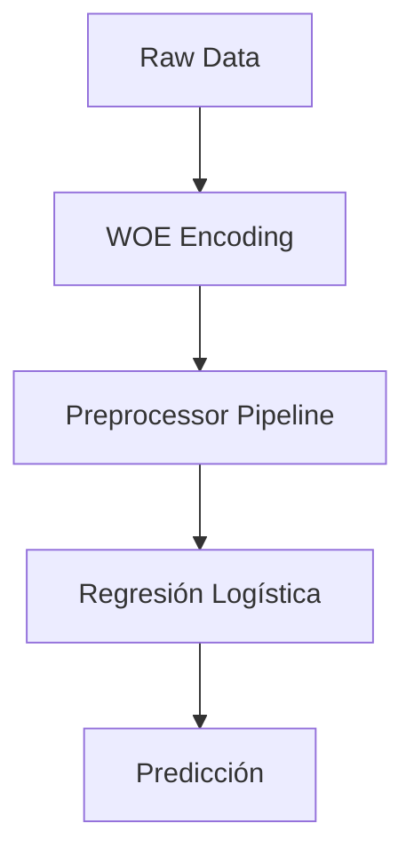
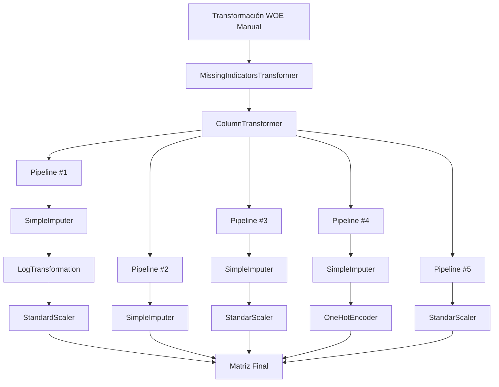
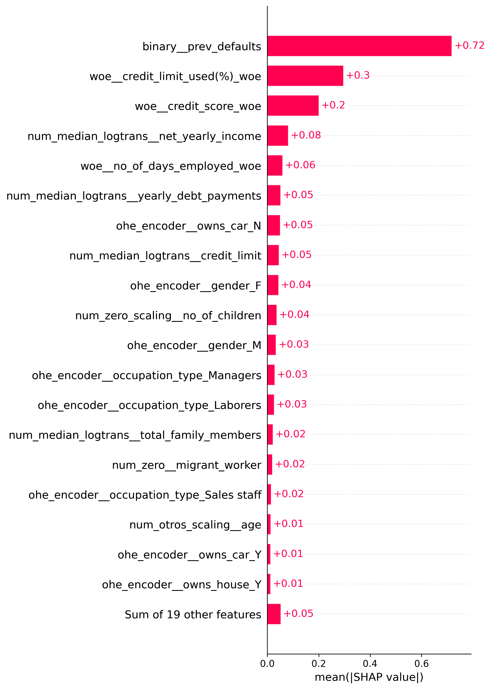
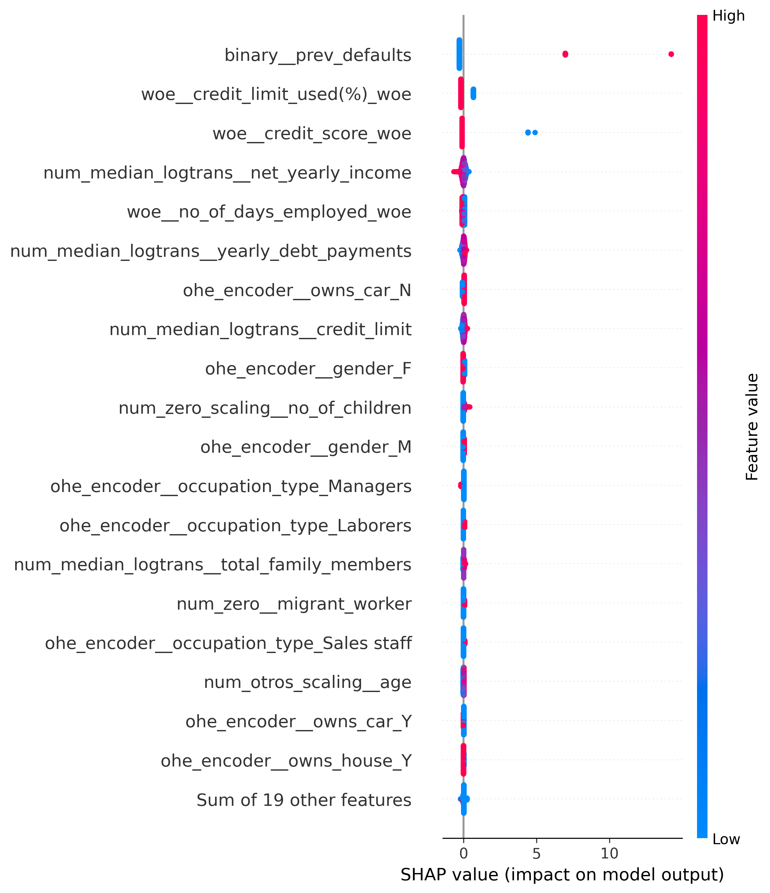
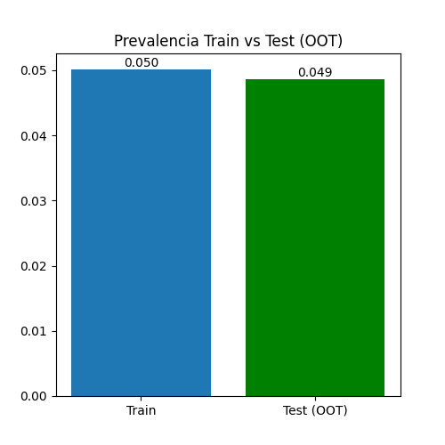
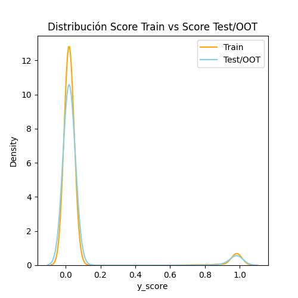
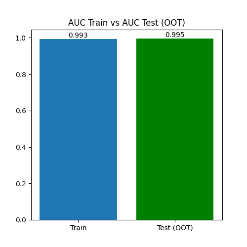
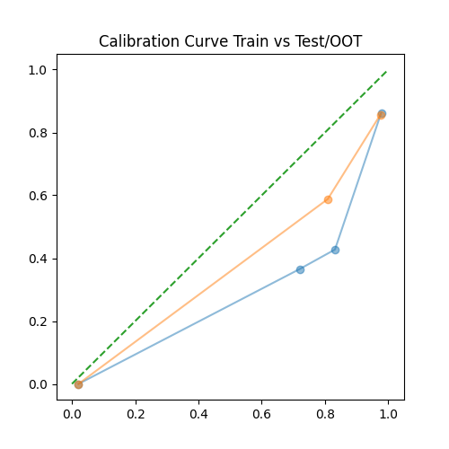

# Sistema de Predicción de Riesgo Crediticio

> Sistema de Machine Learning para predecir incumplimiento crediticio de clientes utilizando técnicas de Feature Engineering, WOE, calibración de probabilidades e interpretabilidad con SHAP.


## Tabla de Contenidos
- [Problema de Negocio](#problema-de-negocio)
- [Arquitectura Funcional](#arquitectura-funcional)
- [Arquitectura Técnica](#arquitectura-técnica)
- [Dataset Train & Validación](#dataset-train--validación)
- [Entrenamiento del Modelo](#entrenamiento-del-modelo)
- [Benchmark de Modelos](#benchmark-de-modelos)
- [Modelo Elegido](#modelo-elegido)
- [Resultados](#resultados)
- [Interpretabilidad](#interpretabilidad)
- [Monitoring](#monitoring)
- [Stack Tecnologico](#stack-tecnologico)
- [Estructura del Repositorio](#estructura-del-repositorio)

## Problema de Negocio

Las entidades financieras necesitan identificar clientes con alta probabilidad de incumplimiento antes de aprobar créditos.

Un modelo predictivo permite:

- Reducir pérdidas
- Optimizar aprobación de créditos
- Mejorar pricing de riesgo

## Arquitectura Funcional


## Arquitectura Técnica



## Dataset Train & Validación

| Propiedad | Valor |
|-----------|-------|
| Filas | 45,528 |
| Columnas | 19 |
| Target | **default_in_last_6months** (binario) |


## Entrenamiento del Modelo



## Feature Engineering
> [!Note]
> Aqui está incluido el WOE Encoding + Preprocessor Pipeline

Se aplicaron:
- Missing Indicators
- Log Transformations
- WOE Encoding
- One Hot Encoding
- Standard Scaling



## Benchmark de Modelos

> [!NOTE]
> Hay altos valores de performance pero una de las
> razones principales es porque tenemos dos features
> muy predictivas (revisarlo en Interpretabilidad ↓)

| Model (en Test) | ROC AUC | PR AUC | Prevalencia |
|-------|---------|--------|-------------|
| Regresión Logística | 0.992 | 0.720 | 0.052 |
| Random Forest | 0.995 | 0.844 | 0.052 | 
| XGBoost | 0.915 | 0.783 | 0.052 |
| LightGBM | 0.998 | 0.981 | 0.052 |

## Modelo Elegido

Modelo seleccionado:

> **Regresión Logística**

> Razones:
> - Interpretabilidad
> - Performance
> - Facilidad regulatoria

## Resultados

| Métrica | Valor | 
|---------|-------|
| ROC AUC | 0.992 | 
| ROC PR | 0.720 |
| Prevalencia | 0.052 |
| Gini | 0.984 |
| Best Threshold (F1 score) | 0.94 |
| Recall | 0.94 |
| Precission | 0.86 |

## Interpretabilidad

Se utilizó SHAP para:

**Importancia de Features (SHAP Bar)**



**Contribución al riesgo (SHAP Beeswarm)**


## Monitoring

Se evaluó el drift vs el dataset test.csv, próximamente se utilizará Grafana para monitorear en tiempo real:

**Target Drift**


**Score Drift**


**Performance Drift**


**Calibración**


## Stack Tecnologico

### Machine Learning
| Librería | Versión | Rol |
|----------|---------|------|
| Scikit-Learn | 1.8.0 | Preprocessing, pipelines, cross-validation |
| XGBoost | 3.1.3 | Modelo de Boosting |
| LighGBM | 4.6.0 | Modelo de Boosting |
| Optuna | 4.7.0 | Optimizador Bayesiano de Hiperparámetros |
| Pandas | 3.0.3 | Manipulación de datos |
| Numpy | 2.3.3 | Funciones numéricas |
| SHAP | 0.50.0 | Interpretador del modelo |

### Trackeo de Experimentos
| Librería | Versión | Rol |
|----------|---------|-----|
| MLflow | 3.11.1 | Trackeo de experimentos, registro de modelos y artefactos |

### Backend & Frontend
| Librería | Versión | Rol |
|----------|---------|-----|
| FastAPI | 0.129.0 | REST API Framework |
| Uvicorn | 0.34.0 | Servidor ASGI |
| Streamlit | 1.58.0 | Front interactivo |

### Infraestructura
| Librería | Versión | Rol |
|----------|---------|-----|
| Docker | 7.1.0 | Construir las imágenes de la aplicación |

## Estructura del Repositorio

```text
proyecto-riesgo-crediticio/
├── artifacts
│   ├── encoders
│   │   └── woe_bins.pkl
│   ├── interpretabilidad
│   │   ├── shap_background.parquet
│   │   └── shap_values.pkl
│   ├── metadata
│   │   └── features_names.pkl
│   ├── metrics
│   │   ├── best_threshold.json
│   │   └── metrics_test_oot.json
│   ├── model
│   │   ├── logistic_final_params.pkl
│   │   ├── logistic_model.pkl
│   │   └── metrics_train.json
│   ├── monitoring
│   │   └── features_psi.parquet
│   ├── predictions
│   │   ├── test_oot_predictions.parquet
│   │   ├── test_predictions.parquet
│   │   └── train_predictions.parquet
│   └── preprocessors
│       └── preprocessor.pkl
├── data
│   ├── features
│   │   ├── X_test_oot_woe.parquet
│   │   ├── X_test_woe.parquet
│   │   ├── X_train_woe.parquet
│   │   ├── y_test_oot_woe.parquet
│   │   ├── y_test_woe.parquet
│   │   └── y_train_woe.parquet
│   ├── interim
│   ├── raw
│   │   ├── test.csv
│   │   └── train.csv
│   ├── splits
│   │   ├── X_test.parquet
│   │   ├── X_train.parquet
│   │   ├── y_test.parquet
│   │   └── y_train.parquet
│   └── transformed
├── Dockerfile.api
├── Dockerfile.frontend
├── docs
│   └── instrucciones.MD
├── frontend
│   └── streamlit_app.py
├── notebooks
│   ├── 01_eda.ipynb
│   ├── 02_feature_engineering.ipynb
│   ├── 03_model_training.ipynb
│   ├── 04_model_evaluation.ipynb
│   ├── 05_monitoring.ipynb
│   └── eda_output.txt
├── params.yaml
├── README.md
├── reports
│   ├── figures
│   │   ├── eda
│   │   ├── feature_engineering
│   │   ├── model_evaluation
│   │   ├── model_training
│   │   └── monitoring
│   ├── metrics
│   │   └── train_classification_report.pkl
│   └── tables
├── requirements.txt
└── src
    ├── features
    │   └── feature_engineering.py
    ├── features_pre.yaml
    ├── main.py
    ├── schemas.py
    ├── transformers.py
    └── utils
        └── negocio.py
```
